# EX-05-Feature-Generation


## AIM
To read the given data and perform Feature Generation process and save the data to a file. 

# Explanation
Feature Generation (also known as feature construction, feature extraction or feature engineering) is the process of transforming features into new features that better relate to the target.
 

# ALGORITHM
### STEP 1
Read the given Data
### STEP 2
Clean the Data Set using Data Cleaning Process
### STEP 3
Apply Feature Generation techniques to all the feature of the data set
### STEP 4
Save the data to the file


# CODE

```

import pandas as pd
df=pd.read_csv("data.csv")
df
from sklearn.preprocessing import LabelEncoder, OrdinalEncoder
oe=OrdinalEncoder()
oe.fit_transform(df[["Ord_1"]])
temp=['Cold','Warm','Hot','Very Hot']
enc=OrdinalEncoder(categories=[temp])
enc
enc.fit_transform(df[['Ord_1']])
df1=df.copy()
df1["Ord_1"]=enc.fit_transform(df[["Ord_1"]])
df1
oe1=OrdinalEncoder()
oe.fit_transform(df[["Ord_2"]])
studies=['High School','Diploma','Bachelors','Masters','PhD']
enc1=OrdinalEncoder(categories=[studies])
enc1
enc1.fit_transform(df[['Ord_2']])
df2=df1.copy()
df2["Ord_2"]=enc1.fit_transform(df[["Ord_2"]])
df2
from category_encoders import BinaryEncoder
be=BinaryEncoder()
newdata=be.fit_transform(df2["bin_1"])
newdata
df3=df2.copy()
df3["bin_1"]=be.fit_transform(df[["bin_1"]])
df3
be1=BinaryEncoder()
newdata2=be1.fit_transform(df3['bin_2'])
newdata2
df4=df3.copy()
df4["bin_2"]=be1.fit_transform(df[["bin_2"]])
df4
from sklearn.preprocessing import OneHotEncoder
ohe=OneHotEncoder(sparse=False)
ohe.fit_transform(df4[['City']])
num=ohe.fit_transform(df4[['City']])
num
df4
from sklearn.preprocessing import LabelEncoder, OrdinalEncoder
le=LabelEncoder()
le.fit_transform(df4[['City']])
df5=df4.copy()
df5["City"]=le.fit_transform(df4[['City']])
df5

from sklearn.preprocessing import MinMaxScaler
scaler=MinMaxScaler()
df6=pd.DataFrame(scaler.fit_transform(df5),columns=['id', 'bin_1', 'bin_2', 'City', 'Ord_1','Ord_2','Target'])
df6

from sklearn.preprocessing import StandardScaler
Stdscaler=StandardScaler()
df7=pd.DataFrame(Stdscaler.fit_transform(df5),columns=['id', 'bin_1', 'bin_2', 'City', 'Ord_1','Ord_2','Target'])
df7

from sklearn.preprocessing import MaxAbsScaler
maxabsscaler=MaxAbsScaler()
df8=pd.DataFrame(maxabsscaler.fit_transform(df5),columns=['id', 'bin_1', 'bin_2', 'City', 'Ord_1','Ord_2','Target'])
df8

from sklearn.preprocessing import RobustScaler
rscaler = RobustScaler()
df9=pd.DataFrame(rscaler.fit_transform(df5),columns=['id', 'bin_1', 'bin_2', 'City', 'Ord_1','Ord_2','Target'])
df9

```
# OUTPUT
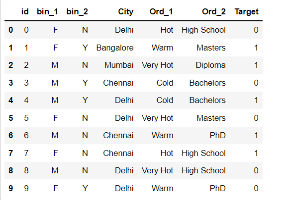
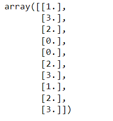
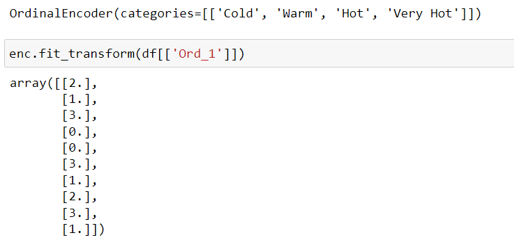
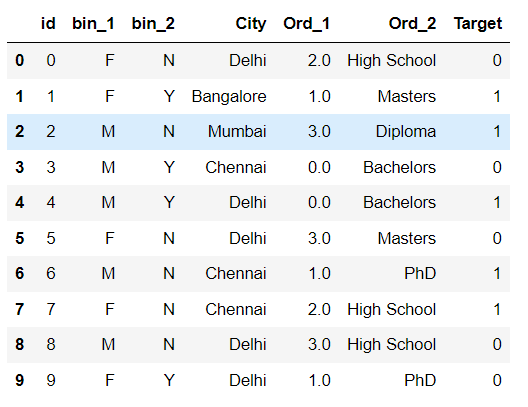
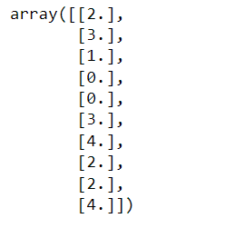
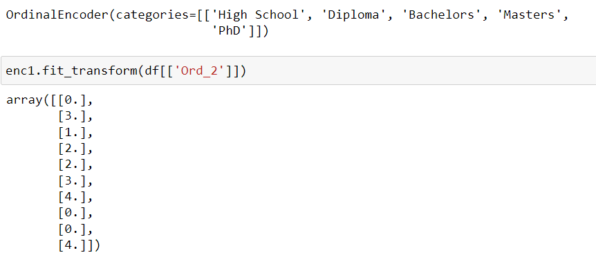
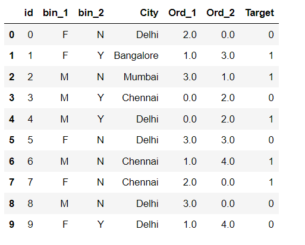
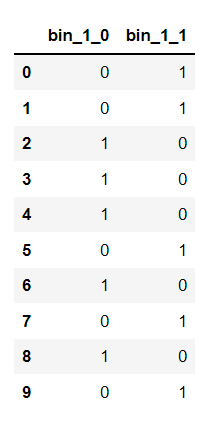
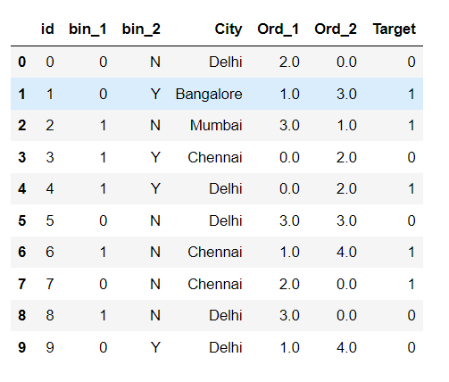
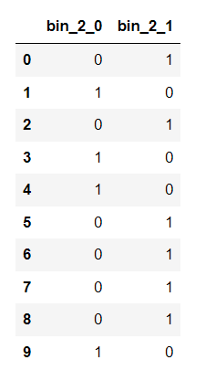
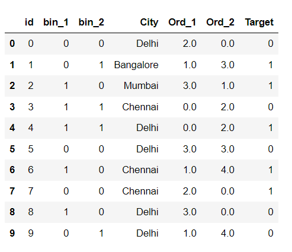
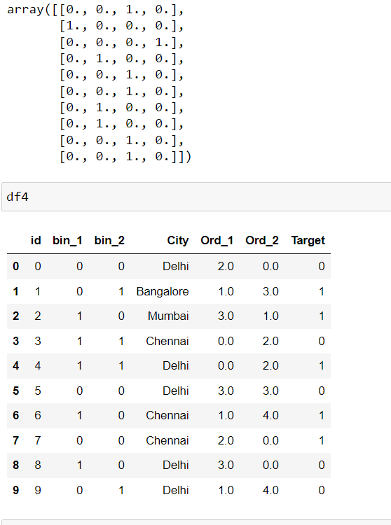
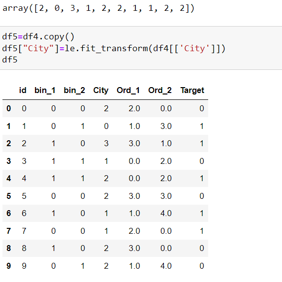
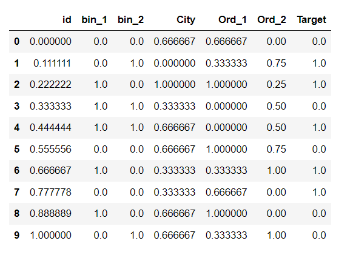
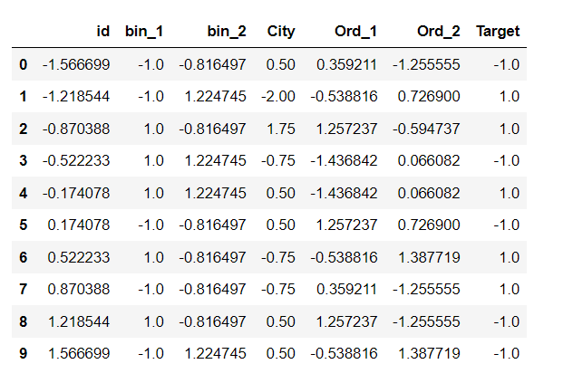
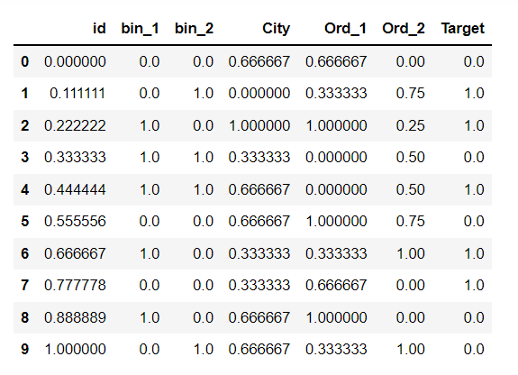
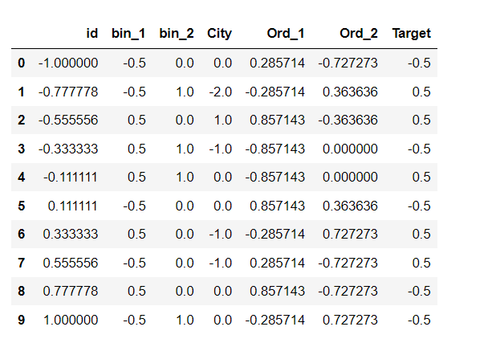

# RESULT
Feature Generation process and Feature Scaling process is applied to the given data frame sucessfully.